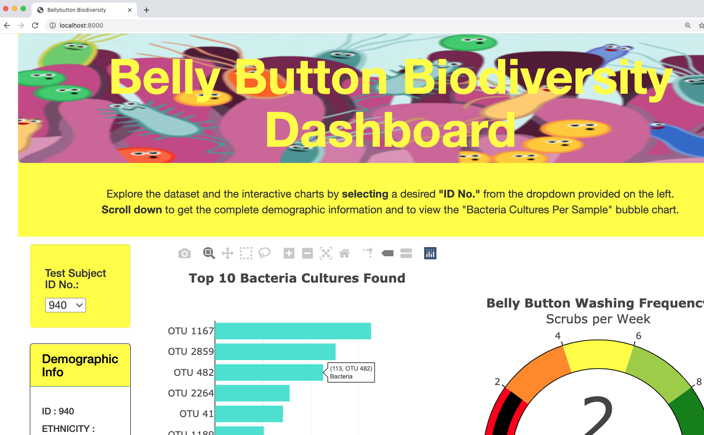
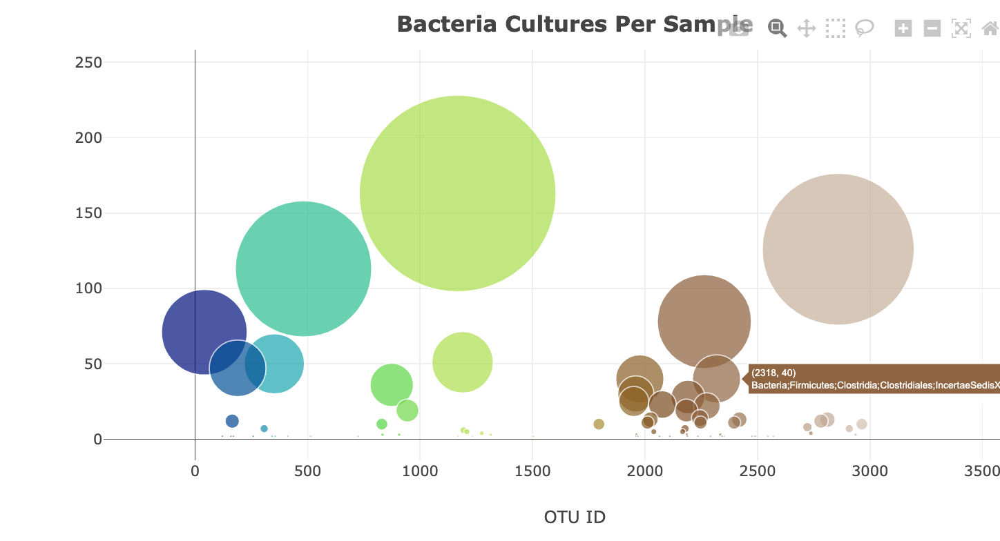

# BellyButton_Biodiversity
Analysis of bellybutton biodiversity data and interactive charts presented using plotly.js.
## Analysis hosted as interactive webpage on github pages
-  https://vinuthabs.github.io/BellyButton_Biodiversity/
- The bellybutton analysis has been hosted as an interactive webpage on github pages which can be used by volunteers or the lab assistants to get more information based on the desired ID.
- Selecting a desired Test ID No. from a dropdown option list of 153 test ids, the webpage refreshes with appropiate "Demographic Info", "Top 10 Bacteria Cultures Found" bar chart, "Belly Button Washing Frequency" Gauge chart, "Bacteria Cultures Per Sample" bubble chart.
- Bar chart and bubble chart have been enabled to bring up more information on hovering closest to the datapoint.  
- Webpage has been designed to be responsive on hand held devices.
- Custom image has been updated and custom background colors have been used to make the webpage more attractive.
- </img>
- </img>
---
---